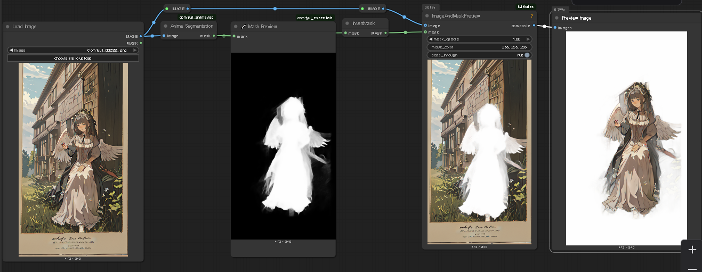

# ComfyUI Anime Segmentation Node

This is a custom node for [ComfyUI](https://github.com/comfyanonymous/ComfyUI) that provides anime image segmentation using the ONNX model from the [anime-segmentation](https://github.com/SkyTNT/anime-segmentation) project by SkyTNT.

The node implementation was built based on the gist [SimpleAnimeSeg.py](https://gist.github.com/city96/SimpleAnimeSeg.py) by GitHub user **city96**, adapting and packaging the model for easy use within ComfyUI.

---

## Features

- Segments anime-style images to extract character masks.  
- Uses the ONNX model file `isnetis.onnx` from SkyTNT’s anime-segmentation repo for efficient CPU inference.  
- Simple integration as a ComfyUI custom node.  
- Designed as a foundation for anime character editing, segmentation, and more.



---

## Installation

1. Download or clone this repository.  
2. Copy the folder `comfyui_animeseg` into your ComfyUI `custom_nodes` directory.  
3. Download the `isnetis.onnx` model file from the official Hugging Face repository:  

   [https://huggingface.co/skytnt/anime-seg/resolve/main/isnetis.onnx](https://huggingface.co/skytnt/anime-seg/resolve/main/isnetis.onnx)  

4. Place the `isnetis.onnx` file inside the `comfyui_animeseg` folder.  
5. Install the required Python packages in your ComfyUI environment:

   ```bash
   pip install onnxruntime torch pillow numpy

---

## Credits

- Model and core segmentation approach by [SkyTNT](https://github.com/SkyTNT).
- Node implementation inspired by the gist [SimpleAnimeSeg.py](https://gist.github.com/city96/...) by **city96**.
- [ComfyUI](https://github.com/comfyanonymous/ComfyUI) for the UI framework.

---

Happy anime editing! 🎨✨
